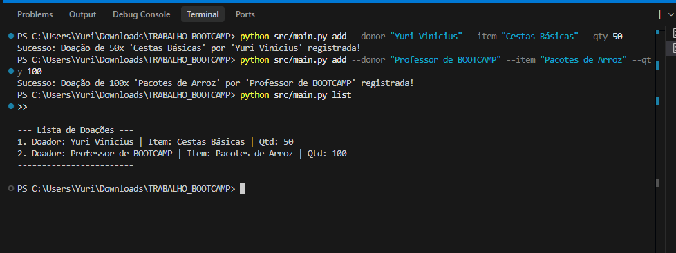

# Projeto Prato Cheio - Sistema de Gestão de Doações para Bancos de Alimentos


## 📌 O Problema
Muitas ONGs e bancos de alimentos têm dificuldade para organizar as doações que recebem. O uso de papel ou planilhas acaba gerando erros no estoque e perda de tempo que poderia ser usado para ajudar quem precisa.

## 💡 A Solução (Projeto Prato Cheio)
O **Projeto Prato Cheio** é um programa de terminal simples feito em Python. Ele permite cadastrar doadores e itens de forma rápida, garantindo que os dados estejam organizados e corretos. O sistema não permite cadastrar quantidades vazias ou negativas, evitando erros comuns de digitação.

## 🎯 Público-Alvo
- Bancos de alimentos locais.
- ONGs que recebem e distribuem suprimentos.
- Projetos sociais e centros comunitários.

## ⚙️ Funcionalidades
- **Cadastro de Doações:** Registro de quem doou, o que foi doado e a quantidade.
- **Lista de Estoque:** Veja em uma lista simples tudo o que já foi coletado.
- **Filtro de Erros:** O sistema bloqueia automaticamente entradas com quantidades inválidas.


## 🛠️ Tecnologias Utilizadas
- **Linguagem:** Python 3.8+
- **Testes Automatizados:** `pytest`
- **Linting e Análises Estáticas:** `flake8`

---

## 🚀 Como Executar o Projeto

**1. Clone e acesse o Repositório:**
```bash
git clone https://github.com/Yurimdev/projeto-prato-cheio.git
cd projeto-prato-cheio
```

**2. Crie e ative o ambiente virtual (Recomendado):**
```bash
# Windows
python -m venv venv
.\venv\Scripts\activate

# Linux / Mac
python3 -m venv venv
source venv/bin/activate
```

**3. Instale as dependências:**
```bash
pip install -r requirements.txt
```

**4. Execute o programa principal:**

*Adicionar nova doação:*
```bash
python src/main.py add --donor "Padaria São João" --item "Pães variados" --qty 50
```

*Listar todas as doações:*
```bash
python src/main.py list
```

---

## 🧪 Como Executar os Testes

Para garantir a qualidade, utilizamos o `pytest`.
```bash
# Na raiz do projeto, execute:
pytest tests/
```
Isso validará o Caminho Feliz, Tratamento de Entradas Inválidas e Casos Limite.

---

## 🔍 Como Executar a Análise Estática (Linting)

Para verificar aderência às normas PEP8 de formatação:
```bash
flake8 src tests
```

---

## 📺 Evidência de Funcionamento

> **Atenção:** 
> *Abaixo está o registro quando executa no terminal:*

```bash
$ python src/main.py add --donor "Yuri Vinicius" --item "Cestas Básicas" --qty 50
Sucesso: Doação de 50x 'Cestas Básicas' por 'Yuri Vinicius' registrada!

$ python src/main.py add --donor "Professor de BOOTCAMP" --item "Pacotes de Arroz" --qty 100
Sucesso: Doação de 100x 'Pacotes de Arroz' por 'Professor de BOOTCAMP' registrada!

$ python src/main.py list

--- Lista de Doações ---
1. Doador: Yuri Vinicius | Item: Cestas Básicas | Qtd: 50
2. Doador: Professor de BOOTCAMP | Item: Pacotes de Arroz | Qtd: 100
------------------------
```

---

## 📸 Provas de Funcionamento (Captura de Tela)

Abaixo está o print da execução dos comandos no terminal:



---

## 📄 Autoria e Licença

- **Autor:** Yuri Vinicius Pereira Martins (RA: 22504945)
- **Disciplina:** Bootcamp II - Entrega Inicial
- **Versão:** 1.0.0
- **Licença:** Todos os direitos reservados. Confira o arquivo `LICENSE` para mais detalhes.
